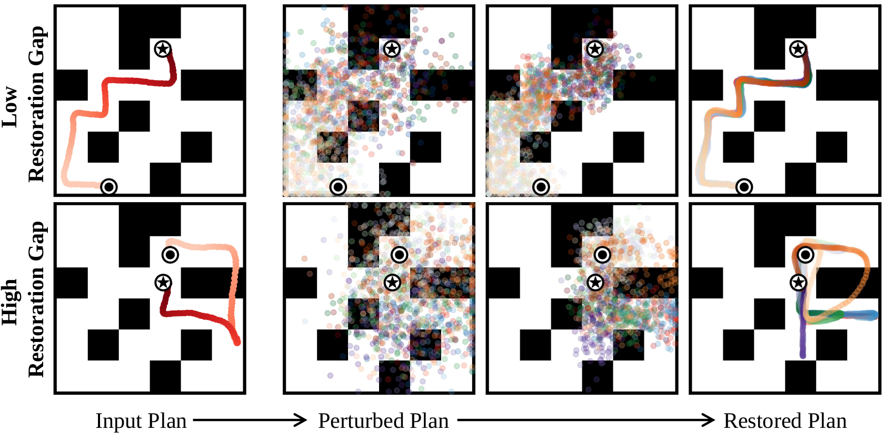
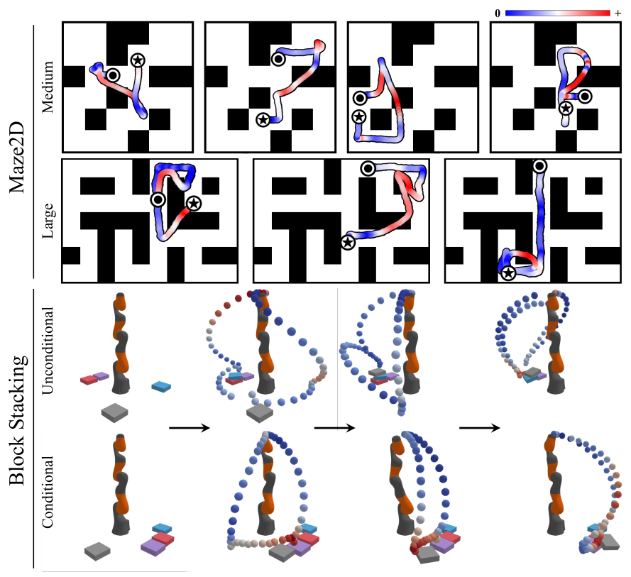

# Refining Diffusion Planner for Reliable Behavior Synthesis by Automatic Detection of Infeasible Plans

<p align='center'>
    
</p>

This repository provides the source codes for our paper "Refining Diffusion Planner for Reliable Behavior Synthesis by Automatic Detection of Infeasible Plans" in NeurIPS 2023.

> Currently, this repository contains only the code for the maze2d experiments. We plan to update this repository after making some preparations, including code clean-up.

## Installation

```bash
pip install -e .
pip install captum==0.6.0 gtimer
cd third_party/diffuser
pip install -e .
```

## Using pretrained models

We offer pretrained models for gap prediction as well as pre-collected synthetic data. To download and set them up, run the following commands:

```bash
bash prepare_pretrained_models.sh
bash prepare_data.sh
```

Executing these commands will download and extract tar files, placing their contents into the `logs/gap_predictor` and `logs/data` directories respectively.

## Planning using pretrained models

Evaluate RGG:

```bash
python scripts/maze2d/evaluate_rgg.py \
	--logbase ./logs/evaluate \
	--env_name maze2d-large-v1 \
	--task single_task \
	--diffusers_repo leekwoon/maze2d-large-v1-H384-T256 \
	--num_episodes 1000 \
	--spec rgg \
	--gap_predictor_path ./logs/pretrained_gap_predictor/maze2d-large-v1-H384-T256/500000_finish/2023_03_26_03_44_06/seed_0/state_best.pt
```

Evaluate RGG+:

```bash
python scripts/maze2d/evaluate_rggplus.py \
	--logbase ./logs/evaluate \
	--env_name maze2d-large-v1 \
	--task single_task \
	--diffusers_repo leekwoon/maze2d-large-v1-H384-T256 \
	--num_episodes 1000 \
	--spec rggplus \
	--gap_predictor_path ./logs/pretrained_gap_predictor/maze2d-large-v1-H384-T256/500000_finish/2023_03_26_03_44_06/seed_0/state_best.pt
```

## Training from scratch

1. Generate synthetic data with:

```bash
python scripts/maze2d/make_data.py \
	--base_datadir ./logs/data \
	--env_name maze2d-large-v1 \
	--diffusers_repo leekwoon/maze2d-large-v1-H384-T256 \
	--n 500000
```

2. Compute restoration gap with:

```bash
python scripts/maze2d/compute_restoration_gaps.py \
	--env_name maze2d-large-v1 \
	--data_path ./logs/data/maze2d-large-v1-H384-T256/500000_finish.npz \
	--diffusers_repo leekwoon/maze2d-large-v1-H384-T256 \
	--strength 0.9 \
	--num_plan 10
```

3. Train a gap predictor with:

```bash
python scripts/train_gap_predictor.py \
	--base_logdir ./logs/gap_predictor \
	--env_name maze2d-large-v1 \
	--data_path ./logs/data/maze2d-large-v1-H384-T256/500000_finish.npz \
	--score_path ./logs/data/maze2d-large-v1-H384-T256/500000_finish_restoration_gaps.npy \
	--seed 0
```

Attribution map can be inspected using `notebooks/maze2d/plot_attribution.ipynb`.

<p align='center'>
    
</p>

## Credit

This repository is extended from [diffuser](https://github.com/jannerm/diffuser) and [diffusers](https://github.com/huggingface/diffusers). 